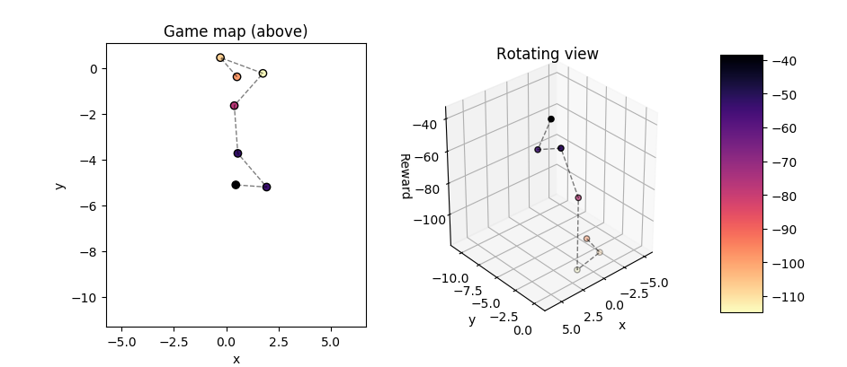
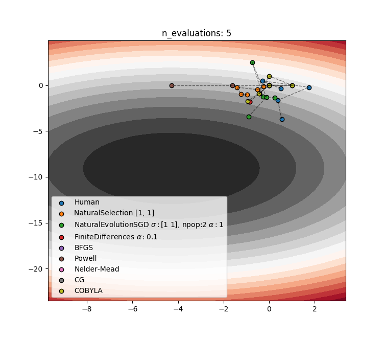

# King of the Hill
Game of human optimization of a 3d surface that after a game can be 
compared to different algorithms. This is an interesting blackbox
optimization problem where

1. gradients are not available
2. the blackbox may be expensive to evaluate

This often arises in real-life reinforcement learning. In these cases
it interesting to consider slower algorithms for selecting the next point
to explore since the blackbox is so expensive. Recently, the natural evolution
strategy has been shown to be very parallellizable and it could beat the
current state-of-the-art in wall clock time. The NES algorithm is displayed
as a competing algorithm

In the figure above, the game map and visualization aids for the human 
can be seen. The next exploration point is selected by clicking on the
game map. The map and 3d visualization can be zoomed in/out using the
scroll wheel. Lastly, the 3d visualization can be rotated to get a better
understanding of where the points are located in space.

Finally, the competition between human and the algorithms can be observed
for each iteration by scrolling through.
